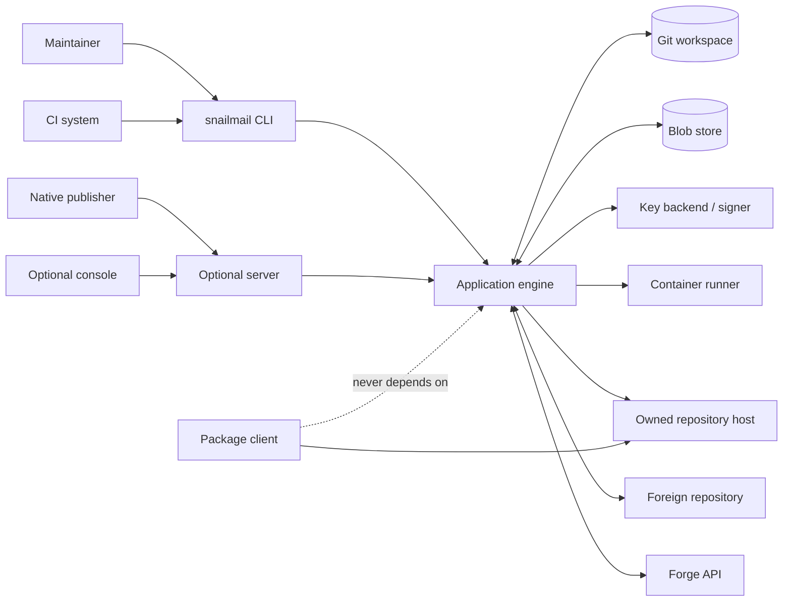
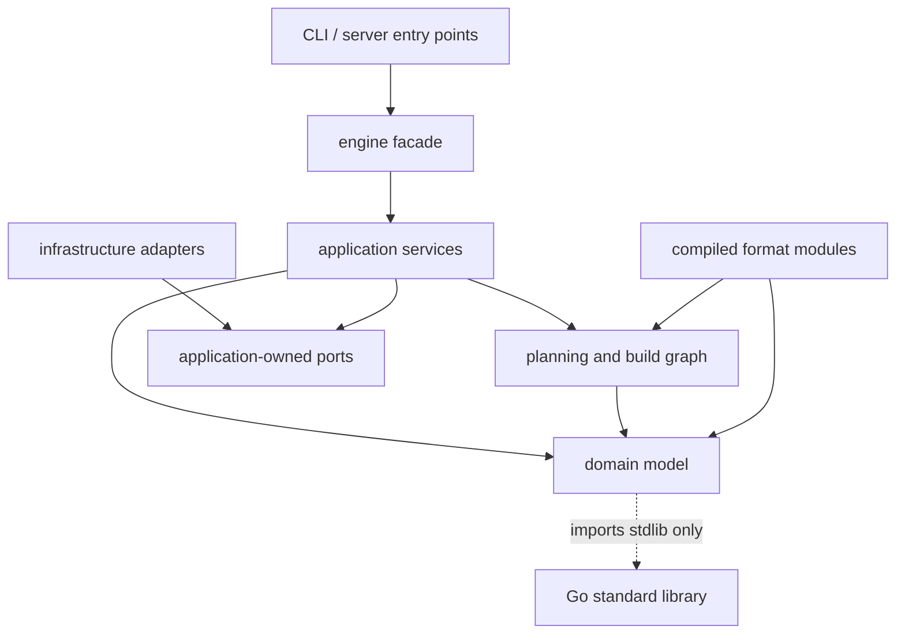
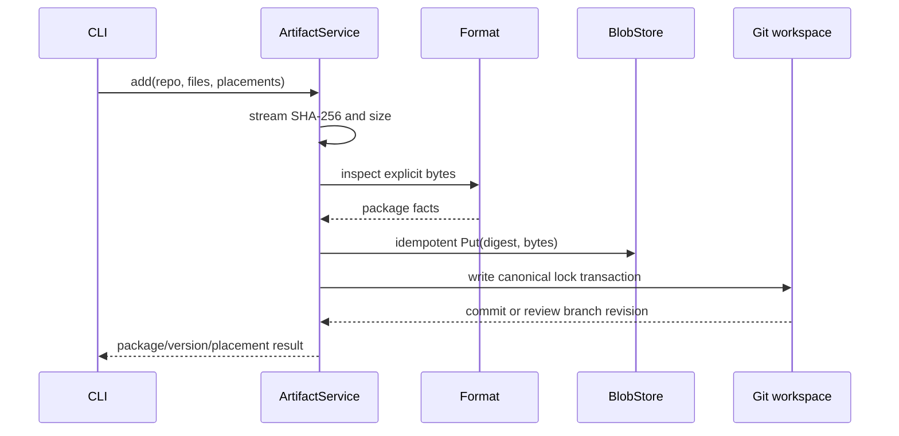
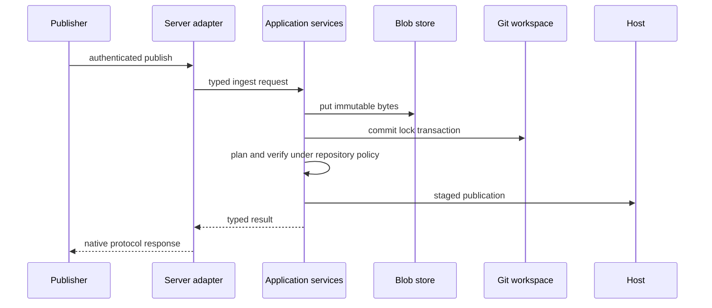

# snailmail architecture

Status: proposed architecture for the implementation described in [PLAN.md](PLAN.md).

This document defines component boundaries, state ownership, execution flows,
and non-negotiable invariants. `PLAN.md` records the product motivation and
broad domain design; this document is the normative implementation contract.
An explicit feasibility decision here supersedes a conflicting planning note
and should be reflected back into the plan when that document is revised.

## 1. Architectural goals

snailmail must:

1. Build repository output deterministically from explicit inputs.
2. keep owned repository state reviewable and recoverable in Git.
3. keep static reads independent of a running snailmail service.
4. apply exactly the operations a user reviewed in a plan.
5. verify with a real ecosystem client before publication.
6. support several formats and infrastructure providers without coupling the
   core to any one of them.
7. run as one static Go binary on a laptop or in CI.

The architecture is a modular monolith with ports and adapters. It is not a set
of network services. The CLI, CI integrations, optional server, and eventual
console all call the same application layer.

### 1.1 Non-goals

- A general package build system. Build and repack operations produce blobs for
  snailmail, but repository management does not depend on a particular builder.
- A transactional database layered over Git.
- A transparent proxy for entire public ecosystems.
- A universal version or dependency implementation.
- Strict atomicity across multiple repositories or foreign services.
- A stable in-process Go plugin ABI. Third-party extensions will use a versioned
  process protocol when that work reaches Phase 5.

## 2. Architectural decisions

The following decisions govern every component:

| Decision | Consequence |
|---|---|
| Git is authoritative for owned repository intent | Manifests and locks are the only durable desired state. |
| Blobs are content-addressed and live outside Git | Git stays reviewable; every referenced byte is immutable. |
| Foreign repositories are observed live | There is no shadow database that can silently drift from them. |
| Repository construction is a deterministic build graph | Network, clock, secret lookup, and deployment cannot occur inside format rendering. |
| Signing is an explicit effect in that graph | A format cannot resolve a `KeyRef` or read an ambient GPG keyring. |
| A plan is a content-addressed execution artifact | `apply` validates and executes it; it never invokes the planner again. |
| Publication is staged and revision-checked | Verification happens before the client-visible commit point. |
| Verification is part of the format contract | A format without a real client test cannot be Tier 1. |
| Drivers are selected only at the composition root | Core packages never switch on provider names. |
| The server is an adapter over the application layer | Running it cannot create a second state model. |

## 3. System context



There are three trust and availability boundaries:

1. **Control plane:** CLI or optional server, engine, Git, signers, and provider
   APIs. It may be unavailable without interrupting package installs.
2. **Artifact plane:** immutable blobs and generated repository trees.
3. **Read plane:** static hosts, CDNs, or a native registry. Consumers only
   depend on this plane.

## 4. State and ownership

### 4.1 Sources of truth

| Data | Authority | Durable | Notes |
|---|---|---|---|
| Workspace topology and policy | `snailmail.toml` in Git | yes | Repositories, remotes, mappings, gates, and host references. |
| Owned repository contents | `repos/<repo>.lock.toml` in Git | yes | Package versions, blobs, and placements. |
| Published-version bindings | `publications/<destination>.jsonl` plus Git history | yes | Append-only evidence that a native version has been submitted or bound to bytes. |
| Artifact bytes | Blob store by SHA-256 | yes | Immutable; location is replaceable. |
| Public keys | Git | yes | Private key material is never in workspace state. |
| Private keys | Key backend | yes | Referenced by opaque `KeyRef`. |
| Owned deployed state | Host snapshot | observed | Compared with desired Git state. |
| Foreign state | Remote API | observed | Queried each run; cache is disposable. |
| Plans | File or CI artifact | temporary/audit | Content-addressed and safe to review; contains no secrets. |
| Apply results | JSON output or CI artifact | audit | The next run still derives truth from Git and live targets. |
| Knowledge data | Embedded bundle or durable knowledge store | yes | The selected immutable digest is pinned in every plan. |
| Cache | Local cache directory | no | Deleting it cannot change behavior, only performance. |

The engine never writes observed foreign state into a lock. An unavailable
remote produces `unknown`, not `missing` and not a remembered value presented as
current.

### 4.2 Workspace layout

```text
snailmail.toml                 workspace manifest
repos/<repo>.lock.toml        one canonical lock per owned repository
publications/<destination>.jsonl
                              append-only owned and foreign publication bindings
keys/<key>.*.pub              generated public key forms
docs/install-<repo>.md        generated consumer instructions
.github/workflows/...         generated integration, when GitHub is selected
.gitlab/...                   generated integration, when GitLab is selected
```

Blobs, private keys, built trees, caches, and temporary plans do not belong in
Git. A plan may be committed deliberately for review, but no command relies on
that convention.

The initial lock representation is one sorted TOML file per repository. Do not
introduce sharding until measured lock size or merge behavior requires it. A
future schema version may add includes without changing the domain model.

The publication ledgers close a safety gap that a current-state lock cannot.
After final verification and before an owned host commit, foreign upload, or
recipe submission, apply appends the exact destination, package-version, blob,
attestation, plan, and artifact or recipe digests it is about to publish. That
append is one expected-revision Git transaction represented in the plan. If the
target effect then fails, the binding remains conservatively reserved and a
retry can publish it; reusing the version for different bytes is forbidden.
This deliberately freezes a foreign version at submission time, even when a
review may merge later, because retrying different bytes under the same version
is less safe than reserving a failed attempt.

Normal rollback edits placements and never edits this ledger. Validation treats
the union of publication records in reachable Git history as binding, so a
revert cannot erase evidence that a version was used. CI checkout generated by
snailmail therefore fetches full history for publication operations. Rewriting
that history is an explicit loss of the immutability audit, not a supported
maintenance operation.

Each record is keyed by `(plan_id, change_id)` and appending an identical record
is idempotent. An apply retry accepts either the plan's original workspace tree
or the exact post-ledger tree digest declared by the plan. Any other Git change
is stale. This lets an interrupted apply resume after the ledger transaction
without weakening its original precondition.

### 4.3 Generated repository manifest

Every owned deployment includes a client-ignored
`snailmail.repository.json`. It contains:

- schema version;
- repository ID and format implementation ID;
- digest of the render inputs and knowledge bundle;
- digest of all client-visible output files;
- path, size, and SHA-256 for each output file;
- generation time supplied by the plan;
- previous published revision, when known.

The file does not include itself in the tree digest. A host adapter combines
this manifest with its native revision, such as a Git commit, object ETag, or
registry digest, to implement stale-plan checks and efficient diffs. On a host
without an existing manifest, the first deployment is a full replacement.

### 4.4 Domain invariants

These rules are enforced in the domain layer before any external effect:

1. A blob digest identifies exactly one byte sequence.
2. A `PackageVersion` is a set of content-addressed blob references and is
   frozen once its publication binding is recorded. Changing bytes requires a
   new native version or revision.
3. Yanking removes placements but preserves the package-version record.
4. Architecture is a blob fact, not a placement coordinate.
5. Distro and track are distinct placement coordinates.
6. A placement can only reference a package version of the repository's format
   and an allowed namespace.
7. Versions are mapped and compared by a format implementation. Generic string
   or semver comparison is forbidden outside formats that define it.
8. Every adopted remote artifact is pinned by digest.
9. Public signing material must match the private signing identity selected by
   the repository.
10. Irreversible target changes are labeled before approval and execution.
11. An attestation names immutable CAS bytes and exact subject blob digests; it
   cannot be moved to another package version after publication.

Facts copied into a lock are review aids and cache hints. When bytes are
materialized, the format parser recomputes facts and rejects disagreement.

## 5. Code architecture

### 5.1 Dependency direction



Dependencies point inward. Application services define the ports they consume;
adapters implement those ports. The application layer never imports concrete
GitHub, S3, Docker, or OpenPGP adapter packages.

### 5.2 Proposed Go package layout

```text
cmd/snailmail/                 CLI composition root
engine/                        small public facade and request/response DTOs
internal/domain/               entities, values, invariants, domain errors
internal/app/                  use cases and effect orchestration
internal/plan/                 plan schema, planner, validation, DAG
internal/buildgraph/           deterministic repository build evaluator
internal/config/               manifest and lock decoding, schema migrations
internal/gitstate/             atomic workspace edits and Git transactions
internal/knowledge/            immutable compatibility data bundles
internal/wire/                 registries and dependency construction
formats/deb/                   pure Debian rules and render operations
formats/pypi/                  pure PyPI rules and render operations
formats/helm/                  pure Helm rules and render operations
formats/...                    later compiled formats
adapters/blob/{local,oras,s3}/
adapters/host/{local,pages,s3,registry}/
adapters/source/{local,http,github}/
adapters/key/{file,kms,pkcs11}/
adapters/forge/{github,gitlab,forgejo,plain}/
adapters/remote/{aur,homebrew,nixpkgs,...}/
adapters/runner/{docker,podman}/
adapters/notify/{webhook,...}/
```

Only `engine` is a supported in-process API. Internal packages can evolve while
the domain is proven. The future external plugin protocol is separate from the
Go package API.

### 5.3 Application services

Application services are cohesive use cases, not one global engine object:

| Service | Responsibility |
|---|---|
| `WorkspaceService` | Initialize, load, validate, and transactionally edit state. |
| `ArtifactService` | Ingest bytes, verify digests, derive facts, and access CAS. |
| `RepositoryService` | Add, promote, yank, retain, and inspect owned contents. |
| `PlanningService` | Compare a workspace snapshot with observed targets and emit a plan. |
| `ApplyService` | Validate and execute a plan DAG without replanning. |
| `VerificationService` | Run structural checks and official client scenarios. |
| `KeyService` | Generate, publish, audit, and rotate signing identities. |
| `StatusService` | Derive the product-by-destination matrix. |
| `SetupService` | Resolve wizard inputs and provision generated state and infrastructure. |
| `DoctorService` | Inspect an arbitrary live repository without workspace state. |

The CLI parses input and renders service results. It contains no repository,
format, or provider behavior. `--json` serializes the same typed result used by
human output.

## 6. Format boundary and deterministic builds

Formats contain ecosystem semantics. They do not own network access,
credentials, containers, deployment, or wall-clock access.

Conceptually, a format exposes the following operations:

```go
type Format interface {
    ID() FormatID

    Inspect(BlobReader) (PackageFacts, error)
    NormalizeName(string) (string, error)
    NameFor(NamingInput, Role) (string, error)
    MapVersion(UpstreamVersion, Distro) (NativeVersion, error)
    CompareVersions(NativeVersion, NativeVersion) int
    RenderRequirement(Requirement, Distro) (NativeRequirement, error)

    Compile(RenderInput) (BuildRecipe, error)
    ExecutePure(PureBuildNode, BuildInputs) (BuildOutputs, error)
    StructuralChecks(RepositoryArtifact) []Finding
    VerificationCases(Repository, RepositoryArtifact) []VerificationCase
}
```

`NamingInput` contains the mapping seed and an optional Product. This preserves
format conventions while allowing vendored packages that have no Product. The
actual interfaces should be split by capability so tests and commands only
depend on what they use. The combined form above documents the boundary.

### 6.1 Explicit render inputs

`RenderInput` includes every value that can affect bytes:

- normalized repository configuration;
- sorted resolved placements;
- exact blob digests, sizes, facts, stored or external acquisition refs, and
  attestation refs;
- public key material and signing identity fingerprints;
- immutable knowledge bundle digest;
- format implementation ID and version;
- generation and expiry times chosen by the planner;
- output schema version.

Formats cannot call `time.Now`, read environment variables, use random global
state, resolve a key reference, or fetch a URL. Files are sorted and timestamps,
owners, compression settings, and line endings are explicit. A configured
signer must produce deterministic output for its selected scheme and options;
setup and planning reject a backend that cannot. There is no weaker
reproducibility tier for supported repository output.

### 6.2 Build recipe

`Compile` returns a content-addressed DAG rather than immediately mutating a
filesystem. Node kinds are:

| Node | Effect |
|---|---|
| Materialize immutable blob | reads a digest already authorized by the plan |
| Pure render or transform | none |
| Sign canonical payload | invokes the selected key backend |
| Assemble file tree | none |
| Structural validation | none |
| Client verification | invokes a runner, before publication |

This shape supports formats with several signing rounds. RPM, for example, may
sign package bytes, generate metadata from those signed bytes, and then sign
`repomd.xml`. A single `BuildIndex(placements, KeyRef)` call would hide these
effects and could not remain pure.

Each pure node declares input and output digests. Each signing node declares the
key identity, scheme, canonical payload, signature time, and allowed output
form. During plan finalization the signer resolves those nodes. Signature bytes
are public, so their responses are embedded in the plan bundle or referenced by
digest from its public attachments. The signer receives no repository or host
credentials. Unexpected, missing, or mismatched signatures abort the build.

The recipe and final tree digests are therefore known at planning time. Apply
replays pure assembly with the authorized signature responses and verifies the
final digest; it does not ask a signer to produce potentially different bytes.
Planning may invoke a signer, but it does not mutate desired state or a publish
target. A plan that cannot resolve all byte-affecting nodes is informational and
cannot be applied.

### 6.3 Acquisition references

A blob identity is always `(sha256, size, facts)`, but its acquisition reference
has two forms:

- `stored`: bytes must exist in the configured CAS;
- `external`: a pinned HTTPS URL used by the generated index without storing
  the bytes locally.

`external` is the curated `proxy` mode from `PLAN.md`, not transparent ecosystem
mirroring. Planning streams the URL and verifies its digest and facts without
putting it in CAS. A format may accept it only when its client protocol can name
an external URL and enforce the pinned digest. Client verification fetches that
URL through the generated index. Deletion or mutation upstream fails planning or
verification and is an accepted availability tradeoff visible in the plan.

### 6.4 Attestations

A `PackageVersion` may carry `AttestationRef` values containing kind, predicate
type, subject blob digests, and the digest of attestation bytes in CAS. SBOMs,
provenance, and detached upstream signatures use this path. They are immutable
with the package version, appear in locks and plans, and are published as
adjacent files or index metadata when the format supports them. Repository index
signatures are build outputs, not PackageVersion attestations.

### 6.5 Repository artifact

The build evaluator returns a `RepositoryArtifact` containing:

- an immutable file tree;
- a tree manifest and digest;
- path classes: payload, subordinate metadata, root metadata, and signatures;
- publication ordering constraints;
- a typed install specification and its canonical rendered instructions;
- structural findings;
- client verification cases.

Install instructions are build outputs, not hand-maintained templates. A typed
`InstallSpec` separates ecosystem operations from the repository endpoint and
credential handle. Pre-commit verification renders that same spec with the
staged endpoint; canonical documentation renders it with the production
endpoint. The post-commit probe executes the exact published text. No test-only
installation path may bypass the spec.

## 7. Ports and adapters

Application ports are small and capability-oriented. Configured provider names
are resolved by registries in `internal/wire`; a missing capability fails during
configuration validation rather than midway through apply.

### 7.1 Core effect ports

| Port | Required semantics |
|---|---|
| `BlobStore` | `Has`, digest-validating `Put`, and digest-validating `Open`; writes are idempotent. |
| `KnowledgeStore` | Load an immutable, signature-verified bundle by digest. |
| `Source` | Separate watch and fetch capabilities; fetched bytes are not trusted until hashed. |
| `Signer` | Report public identity and sign an explicit canonical request without exposing key bytes. |
| `Host` | Observe revision, stage with a faithful preview, conditionally commit or restore, abort stage, and report capabilities. |
| `RemoteObserver` | Return present, missing, or unknown with freshness and native version. |
| `RemotePublisher` | Plan and execute recipe or upload changes with native preconditions. |
| `Forge` | Git refs, reviews, CI wiring, secret references, environments, and approval evidence. |
| `Runner` | Execute a pinned image with explicit mounts, network policy, limits, and captured output. |
| `Notifier` | Deliver typed events; notification failure cannot rewrite publish outcome. |

A driver must return typed errors that preserve whether an operation is safe to
retry. Provider-specific SDK values do not escape the adapter.

### 7.2 Host protocol

The host boundary is intentionally stronger than `Sync(fs.FS)`:

```go
type Host interface {
    Capabilities(context.Context, Repository) (HostCapabilities, error)
    Observe(context.Context, Repository) (PublishedRevision, error)
    Stage(context.Context, RepositoryArtifact) (StagedPublication, error)
    Commit(context.Context, StagedPublication, ExpectedRevision) (CommitResult, error)
    Restore(context.Context, RestoreRef, ExpectedRevision) (PublishedRevision, error)
    Abort(context.Context, StagedPublication) error
}
```

`StagedPublication` includes a preview endpoint served by the selected host with
the same relative-path, encoding, header, and authentication behavior as its
canonical endpoint. Its base URL may be an isolated staging prefix. Official
clients verify against that endpoint before `Commit`. A format/host pair that
cannot provide a faithful preview cannot claim Tier 1 and is unsupported when
pre-publication client verification is required.

`CommitResult` contains the new revision and, when supported, a `RestoreRef` for
the retained prior revision. `Restore` is conditional on the current revision
still being the failed revision, preventing rollback from overwriting a newer
publisher. A host that cannot retain and restore the prior revision reports that
capability and never receives an automatic-rollback promise.

`Commit` is the client-visible point. Its guarantees depend on the host:

| Host class | Commit behavior |
|---|---|
| Local directory | Rename a complete staged directory on the same filesystem. |
| Git-backed Pages | Move the publish ref to a complete orphan commit. |
| Object storage | Upload payload first, publish root metadata last with conditional writes, then defer deletion. |
| `rsync` host | Transfer payload first and metadata last; no claim of strict atomicity. |
| Native registry | Use the registry's digest and tag commit protocol. |

The corresponding preview mechanisms are:

| Host class | Preview behavior |
|---|---|
| Local directory | Engine HTTP server over the staged directory. |
| Git-backed Pages | Publish to a dedicated preview Pages site provisioned with the same provider settings, then move the production site's publish ref only after verification. |
| Object storage | Upload to a unique staging prefix and use that origin or CDN prefix as the repository base. |
| `rsync` host | Upload to a versioned release directory exposed by a configured preview base URL, then switch the canonical symlink or metadata. Without that layout it is not Tier 1. |
| Native registry | Push an unadvertised temporary tag or manifest and verify by digest before moving the canonical tag. |

Pages staging never changes the production site's ref. `setup` provisions a
companion preview site or rejects pre-publication verification for that host.
The preview namespace is disposable and is not emitted in consumer
instructions. A post-commit canonical probe catches behavior introduced by a
custom domain or CDN that the provider preview cannot reproduce.

GitHub Pages is a public host for snailmail. Its private-repository access model
does not provide package clients with suitable per-repository credentials, so
`visibility = "private"` is rejected for that adapter. Private static
repositories use an authenticated object-store/CDN adapter or the optional
server.

The planner rejects a format/host pair when preview, restore, or commit
capabilities cannot satisfy the configured verification and publication rules.
Object stores and CDNs cannot promise a globally atomic view, so signed root
metadata and checksums remain the client integrity boundary.

No adapter deletes the old reachable tree before the new commit point. Cleanup
is a separate, retryable operation with a grace period.

### 7.3 Knowledge bundle

Compatibility data is an immutable, versioned artifact containing key rules,
distro metadata, dependency capabilities, and verification image pins. The
binary embeds a default bundle so core operations work offline. `knowledge
update` fetches a newer signed bundle into a durable digest-addressed
`KnowledgeStore`, separate from disposable request caches. An executable plan
either bundles the selected public knowledge artifact or references a durable
store accessible to apply. It always pins the artifact by SHA-256.

This gives data an independent release cadence without making repository builds
depend on mutable network data.

## 8. Command and execution model

Commands fall into four groups:

1. **Desired-state edits:** `add`, `promote`, `yank`, `prune`, setup changes,
   and key reference changes.
2. **Read-only derivation:** `check`, `status`, `doctor`, and `render`.
3. **Reconciliation:** `plan`, `apply`, and `verify`.
4. **Gate routing:** branch/PR creation and approval handling.

Desired-state commands never publish directly. They make a validated lock or
manifest transaction. Gate handling determines whether that transaction is
committed on the current branch, proposed in a review branch, or held for
approval. Deployment always reconciles committed desired state.

### 8.1 Artifact ingestion

`snailmail add` performs this transaction:



If the Git transaction fails after CAS upload, the blob is harmless and
unreachable. The workspace-scoped garbage collection protocol in section 9.3
eventually removes it.

### 8.2 Planning

Planning is non-mutating with respect to desired state and publish targets. It
may read CAS and targets and invoke a deterministic signer to finalize public
build outputs:

1. Load and schema-validate the manifest and locks at one Git revision.
2. Resolve formats, drivers, public keys, and the knowledge bundle.
3. Validate all domain invariants and provider capabilities.
4. Materialize stored blobs and stream-check external refs by digest, then
   recheck facts.
5. Observe owned host revisions and foreign targets.
6. Compile deterministic build recipes and remote changes.
7. Resolve signing nodes and require a finalized artifact and tree digest.
8. Build a dependency DAG with gates, reversibility, preconditions, and
   verification requirements.
9. Canonically encode the plan payload and calculate its ID.

Unknown observation blocks a mutating change by default. An explicit override
is represented in the plan so review shows that a precondition was bypassed.

### 8.3 Plan schema

A plan uses a versioned envelope. `payload` is encoded with RFC 8785 JSON
Canonicalization Scheme using integer or string numeric fields. `plan_id` is
`sha256(JCS(payload))`; the envelope's ID, display annotations, envelope
attestations, approval evidence, and execution results are excluded from that
hash. Resolved repository signature outputs are part of the payload. Approval
evidence separately binds the resulting `plan_id`.

The payload contains at least:

```text
schema version
engine and format implementation versions
workspace Git revision
manifest, lock, and knowledge digests
explicit generation time and expiry
observed target revisions or API preconditions
expected before and after state for every effect node
ordered change DAG
render input and build recipe digests
final artifact tree digest and resolved public signature outputs
blob and public key fingerprints
gate and approval requirements
reversibility classification
verification cases
```

It contains no private key material, bearer token, decrypted secret, or
provider credential. Human output is a rendering of this typed plan, not a
second unstructured plan implementation.

Plans expire because repository metadata, signatures, observed revisions, and
approval evidence can become stale. Expiry is an input chosen during planning,
not an ambient check hidden in a format.

### 8.4 Apply

`apply` never calls `PlanningService`. It:

1. validates the plan ID, schema, implementation compatibility, and expiry;
2. verifies that Git and every target satisfy a recorded before-state or the
   exact after-state of an already completed idempotent node;
3. loads only the blobs, bundled knowledge data, and public signing identities
   authorized by the plan;
4. compiles the recipe again and requires the same recipe digest;
5. evaluates pure nodes with the plan's resolved signatures and requires the
   planned final tree digest;
6. runs structural checks;
7. stages target changes and obtains host preview endpoints;
8. runs the pinned official clients against those selected-host previews;
9. appends newly published version bindings to Git;
10. commits each target against its expected revision;
11. probes the canonical endpoint and emits a typed result.

Any mismatch before a publish-target commit returns `stale_plan`; the user must
create and review a new plan. There is no `--force` mode that silently weakens
preconditions. A deliberate bypass must be part of a newly generated plan.

Independent repository build, stage, and verification subgraphs may execute
concurrently. Newly published bindings from one apply are appended in one
serialized Git transaction before any target commits, after which independent
host commits may proceed concurrently. A rollout across repositories is not
atomic and reports partial success honestly.

Every effect node is keyed by `(plan_id, change_id)` and records enough expected
state to distinguish not-started from exactly-completed. Host retries accept the
original revision or a deployed `snailmail.repository.json` with the planned
tree and plan digests. Ledger retries use the planned post-ledger tree digest.
Remote publishers use native idempotency keys or an exact observable
postcondition. If an irreversible remote has neither, an interrupted call is
`indeterminate` and requires observation or operator resolution; apply never
blindly repeats it.

### 8.5 Verification

Verification has three layers:

| Layer | Timing | Purpose |
|---|---|---|
| Structural | during build | Parse generated indexes, signatures, paths, and checksums. |
| Client | before commit | Install from the selected host's staged preview using a pinned official client image. |
| Canonical probe | after commit | Catch canonical path switching and CDN cache behavior. |

A client verification case includes image digest, platform, install
instructions, expected package/version, network policy, timeout, and resource
limits. Image pull failure is `infrastructure_failure`, not
`repository_verification_failure`.

If the canonical probe fails, apply automatically calls conditional `Restore`
only when the target is reversible and `CommitResult` retained a prior revision.
Otherwise it marks the rollout failed and emits remediation without pretending
the publication did not occur.

Remote uploads that cannot be tested before publication require a preflight or
sandbox check plus a post-publication native client check. Their irreversible
nature remains visible in the plan.

## 9. Gates, Git, and concurrency

### 9.1 Gates

Gates are target policy interpreted by the application layer:

| Gate | Architecture behavior |
|---|---|
| `auto` | Commit desired-state edit and execute an eligible plan directly. |
| `pr` | Put the exact state or recipe diff on a branch and open/update a review; merge triggers reconciliation. |
| `approval` | Require approval evidence bound to the plan ID before apply can pass the gate node. |

Forge adapters translate these behaviors into pull requests, merge requests,
protected environments, or manual jobs. Plain Git uses current-branch commits
and an interactive approval record. The core gate model does not mention a
specific forge.

Approval is bound to the plan ID, target, approver identity, and expiry. Editing
or regenerating a plan invalidates prior approval.

The Phase 2 plain-Git approval record is an Ed25519 signature. Allowed public
keys are reviewed in the manifest and executable plan; private keys remain
outside the workspace. GitHub PR gates bind the configured state repository,
merged review, default branch, and exact reachable Git revision. Apply evaluates
all non-noop gates before staging and re-evaluates immediately before each
stage, commit, or compensating restore.

### 9.2 Workspace concurrency

Local mutations use an advisory workspace lock, write-temp-and-rename, and an
expected Git parent revision. CI may retry by fetching and replaying a semantic
command on the new head. It must not blindly resolve a lock conflict or reuse a
plan based on the old revision.

Locks are serialized canonically by stable identity, with one placement per
record, to minimize merge conflicts.

### 9.3 Publication concurrency

Apply uses both:

- a per-repository execution lease where the forge or host provides one; and
- host-native compare-and-swap against the revision recorded in the plan.

The lease reduces wasted work. Compare-and-swap provides correctness. A lease
alone is insufficient because it can expire or be bypassed.

Blob writes and reads are safe to parallelize because their keys are content
digests. Remote API mutations use their native ETag, commit, version, or package
precondition whenever one exists.

CAS garbage collection is workspace-scoped. The default physical key includes
an immutable workspace ID, so one workspace cannot collect another's bytes even
when both use the same bucket or registry. Reachability includes every current
lock, all publication ledgers, yanked package-version records, attestations, and
configured federated locks. Cross-workspace deduplication requires an explicit
shared root registry and is not part of the initial implementation. Deletion is
mark, tombstone, grace period, then sweep.

## 10. Status and rollout model

`Rollout` is initially a derived view, not another stored aggregate. It combines:

- the selected upstream release;
- owned placements from locks;
- deployed owned revisions;
- live remote observations;
- forge review and approval state;
- verification results available from the current run or CI provider.

Audit dates and identities come from Git commits, plan approvals, target APIs,
and apply results. If a durable rollout object becomes necessary later, it must
be committed as event data in Git rather than introduced as a hidden database.

Publication ledgers are committed before host effects to preserve immutable
package-version bindings and permit exact retries; they are not deployment
proof. After every canonical probe succeeds, apply commits a separate
repository-level deployment receipt. The static status renderer reports
`current` only when desired lock bytes, ledger binding, and deployment receipt
agree. Missing or stale receipts remain `unknown` or `lagging` rather than being
collapsed into success.

Every status cell is one of `current`, `lagging`, `missing`, `pending`,
`failed`, or `unknown`. Cached observations carry age and origin. `unknown` can
never be collapsed into `missing`.

The manifest stores each destination's allowed lag duration. Status maps the
selected upstream release into the destination's native version and compares it
with `Format.CompareVersions`. An older observed version is `current` during
the tolerance measured from the upstream release time, then `lagging`.
Equivalent or newer destination versions are `current`; absent packages are
`missing`; stale or failed observations are `unknown`. Pending gates and failed
verification override version-derived state while retaining version detail.

## 11. Security model

### 11.1 Trust assumptions

- Manifests, locks, downloaded artifacts, repository indexes, plugin output,
  and remote API responses are untrusted input.
- A repository signing key vouches for indexed bytes, including adopted bytes.
- Git review protects desired state but does not replace artifact digest and
  signature verification.
- A compromised host can deny service or serve stale content; client-visible
  signatures and checksums limit undetected modification where the ecosystem
  supports them.

### 11.2 Secret handling

Secret references are resolved only while executing an authorized effect.
Secrets are never passed to format code, written to plans, emitted in structured
events, or included in crash output. Long-lived host, provider, and signing
credentials are never exposed to verification containers.

Private-repository verification uses a one-time, read-only credential scoped to
the staged revision. `Host.Stage` obtains it through a credential broker and
returns an opaque secret handle, not token bytes. The current PyPI S3 slice
injects Basic credentials through a mode-0600 netrc under pip's isolated
temporary home, scrubs that file when pip exits, masks derived values from
output, and destroys the handle. Containerized clients use the runner's
in-memory secret channel instead. The token has no publish permission and
expires with the stage. A host that cannot issue such a scoped credential is
unsupported for pre-publication verification of private content.

Adapters request the narrowest credential for one operation. OIDC federation is
preferred over long-lived cloud credentials. The key backend returns signatures
and public identity, not private bytes, whenever remote signing is supported.

### 11.3 Untrusted artifact handling

Parsers use bounded readers and enforce maximum file count, metadata size,
decompression ratio, path length, and nesting depth. Archive extraction rejects
absolute paths, `..`, device files, and escaping links. Format parsers and index
decoders are fuzz targets.

Build and remote recipe validation run through `Runner` with:

- a pinned image digest;
- read-only inputs;
- a temporary writable directory;
- no host socket;
- explicit network policy;
- CPU, memory, process, and time limits.

Third-party extension processes receive the minimum typed request and no ambient
credentials. Host and key plugins require separate explicit trust because their
jobs inherently perform privileged effects.

## 12. Optional server

The server exposes native write protocols and the same application requests as
the CLI. Its write path is:



The server has no authoritative database. Authentication sessions and transient
rate-limit state may use external infrastructure, but repository truth remains
Git, CAS, and live targets. Per-workspace writes are serialized and use the same
expected-revision rules as CLI operations.

If a process stops after storing a blob but before committing Git, the blob is
unreachable and later collected. If it stops after the Git commit, the next
reconciliation observes and completes deployment. If it stops during host
staging, the host adapter can abort or garbage-collect the uncommitted stage.

High-write-rate direct mode is outside the initial architecture because it
weakens Git audit and rollback semantics. It requires a separate design before
implementation.

## 13. Deployment topologies

All supported topologies use the same manifest, locks, plan schema, build graph,
and repository artifact:

| Topology | Control plane | Blob store | Read plane |
|---|---|---|---|
| Solo | local CLI | local CAS | local directory/server |
| Forge-native | CLI container in forge CI | registry or releases | forge Pages |
| Cloud static | any CI | object store CAS | object storage plus CDN |
| Server | optional server | object store or registry | static host or registry |
| Hybrid | CLI and server | object store or registry | CDN for reads, server for writes |

Changing topology is a driver configuration change. A topology-specific feature
must not alter the lock schema or repository output for the same explicit render
inputs.

## 14. Failure model and observability

Errors have stable categories and machine-readable fields:

| Category | Meaning | Retry expectation |
|---|---|---|
| `invalid_state` | Schema or domain invariant failed. | Fix state. |
| `stale_plan` | Git, target revision, recipe, or approval changed. | Re-plan and review. |
| `auth_failure` | Credential absent, expired, or insufficient. | Fix credential. |
| `infrastructure_failure` | Network, image pull, provider outage, or quota. | Usually retryable. |
| `build_failure` | Deterministic render or signing contract failed. | Fix inputs or implementation. |
| `verification_failure` | Generated or deployed repository failed a real client check. | Block commit, or conditionally restore after a canonical failure. |
| `target_rejected` | Foreign service rejected a valid attempted change. | Inspect target response. |
| `partial_apply` | Some independent target commits succeeded. | Reconcile remaining targets. |

Every command emits structured events internally. Human logs and `--json`
results are two renderers over those events. Events include plan ID, repository,
change ID, target revision, duration, retryability, and redacted cause. They do
not include secrets or full artifact payloads.

There is no required telemetry service. CI logs and result artifacts are enough
for the initial implementation. OpenTelemetry export can be an optional adapter
later.

## 15. Testing strategy

Architecture claims are enforced by test layers:

| Test layer | Required coverage |
|---|---|
| Domain unit tests | Identity, immutability, placement, mapping, gate, and reversibility invariants. |
| Format unit/property tests | Version mapping/comparison, name normalization, dependency rendering, and parser fuzzing. |
| Golden repository tests | Byte-for-byte trees from fixed inputs, including timestamps and signatures. |
| Format conformance | Official clients install from every Tier 1 golden tree in pinned containers. |
| Adapter contract tests | CAS idempotence, host stage/commit/CAS behavior, signer identity, and remote unknown handling. |
| Planner tests | Canonical plan IDs, complete preconditions, change ordering, and irreversible labels. |
| Apply failure-injection tests | Crash before/after each effect, stale revision, failed verification, and rollback behavior. |
| Topology end-to-end tests | Local and one forge-native path from `setup` through client install. |

Additional mandatory checks:

1. Run a deterministic build twice in clean processes and compare every byte.
2. Verify that `apply` cannot access a blob, key, target, or change absent from
   its plan.
3. Verify every Tier 1 `InstallSpec` against staging and execute the exact
   generated canonical text in the post-commit probe.
4. Run the same fixture through local and forge-native topology adapters and
   compare client-visible trees.
5. Simulate unavailable remotes and assert status is `unknown`.

Golden tests alone do not grant Tier 1. The official package client is the final
conformance authority.

## 16. Scaling and evolution

The initial implementation optimizes for correctness below roughly 10,000
placements per repository:

- full deterministic regeneration;
- one lock file per repository;
- bounded parallel blob materialization;
- short-lived, explicit remote observation cache;
- full staged verification for changed repository targets.

Metrics should be collected locally for lock parse time, render time, tree size,
changed path count, verification duration, and remote request count. Incremental
rendering, lock sharding, and distributed execution are only justified by those
measurements.

Incremental rendering, if added, is a cache over the same build DAG. A clean
full build must produce the identical artifact digest. It cannot introduce a
second output path.

Federated workspaces may reference locks in several Git repositories. Each lock
retains its own revision and plan precondition. Cross-repository apply is
explicitly non-atomic; centralizing locks remains the default.

## 17. Initial implementation slice

Build the architecture in vertical slices rather than creating every interface
up front:

The phase numbers below use the canonical roadmap in `PLAN.md` §14:

1. **Phase 0:** implement the pure domain and build graph with PyPI, Debian, and
   Helm golden trees, local `serve`, and official-client verification. No
   manifest, Git state, or remote hosting is needed for this proof.
2. **Phase 1:** add the manifest, locks, local CAS, publication ledger, exact
   plan/apply, and local managed release switching.
3. **Phase 2:** add the provider-neutral host port and owned remote hosting.
   Public S3-compatible PyPI is the first slice; private-capable S3, public
   GitHub Pages, shared remote blob storage, publication gates, the public
   status renderer, and containerized CI distribution complete the phase. The
   implemented slice includes all of these components for the current PyPI
   remote-host scope.
4. **Phase 3:** add explicit signing and key operations, operational status and
   adoption commands, the knowledge bundle, and additional Tier 1 formats. The
   implemented first slice provides encrypted file-backed RSA4096 OpenPGP keys,
   committed public forms, compatibility audit data, plan-resolved deterministic
   signer responses, and signed Debian `InRelease`/`Release.gpg` assembly. Each
   signing node records its ID, dependencies, scheme, payload digest, allowed
   output path, response digest, and a content-addressed recipe digest. Signing
   identity and plan state are list-shaped for future overlap rotation, while
   the first backend currently permits one active key. Apply replays those
   public responses and never resolves private key references.

   Debian key rotation is a receipt-backed state machine. `introducing` keeps
   the old active signer and publishes an ordered old-plus-successor binary
   keyring at a stable path. `activated` signs with the successor while retaining
   both public identities. Retirement rewrites trust to successor-only. Each
   transition requires the exact prior trust tuple in a canonical deployment
   receipt and a minimum seven-day refresh interval measured from that receipt's
   `trust_since`; manifest, plan, and staging timestamps grant no transition
   authority.
5. **Phase 4:** add read-only foreign observation before irreversible remote
   publication targets.
6. **Phase 5:** add optional server, console, forge-app, attestation, and
   process-plugin adapters only after the static workflow is established.

Only extract a port when a use case needs an effect or a second implementation
proves variation. The architectural boundaries above are firm; speculative
provider methods are not.

This deliberately corrects the old phrase "private PyPI on GitHub Pages" in
`PLAN.md`: GitHub Pages can host a self-owned public index, but it is not a
client-compatible private package host. The private five-minute target uses S3
or another authenticated object-store/CDN implementation.

## 18. Acceptance criteria

The architecture is working when all of these are true:

- Removing the control plane does not interrupt installs from a published
  static repository.
- Given the same explicit inputs, two clean builds have the same tree digest;
  nondeterministic signer configurations are rejected.
- `apply` rejects a changed Git revision, target revision, knowledge bundle,
  format implementation, key identity, or build recipe.
- No production repository commit occurs before structural and staged client
  verification.
- A failed or interrupted stage leaves the prior published revision reachable.
- A provider adapter can be replaced without changing domain or format code.
- An unavailable foreign API renders `unknown` and cannot silently authorize a
  mutation.
- The CLI, CI wrapper, and optional server invoke the same application service
  for an equivalent operation.
- Private keys and long-lived provider credentials never appear in Git, plans,
  generated trees, logs, or verification containers; staged read tokens use the
  runner secret channel only.
- Every Tier 1 format is continuously installed by its official client from a
  freshly generated repository.
